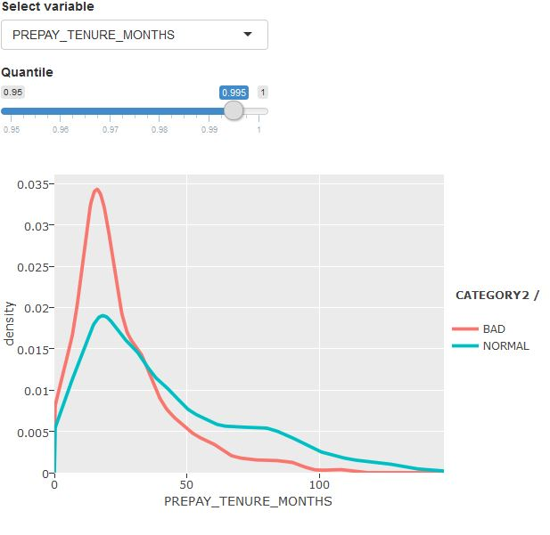
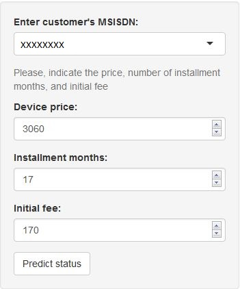
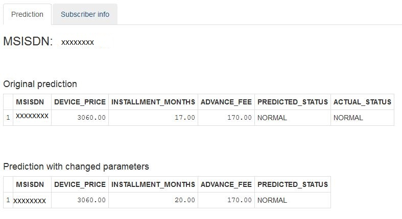
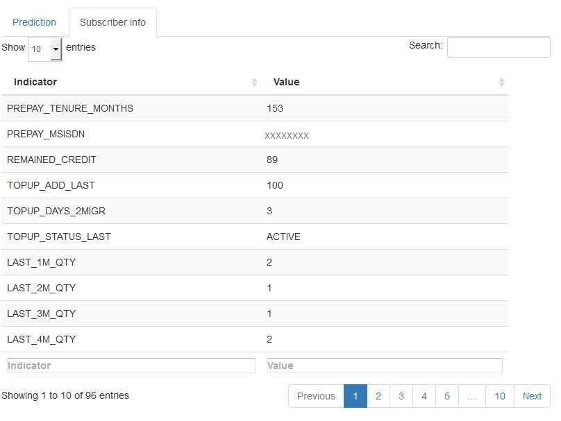

---

output: html_document
---

## Prepay Device Fraud Prediction application

Author:  *O.Trofilov*

Date:   *2016-02-03*

---

## Introduction

The application is aimed to predict a possibility of an event when a Prepay customer willing to buy a device in installment will not pay the installment fee, thus commiting a fraudulent acqusition.

For that purpose, such a situation can be predicted based on historical information on the customer recharges and consumption, being the input for the prediction model constructed on the basis of information about all other sales of devices to Prepay customers done statring from 1-May-2015 till 30-Sep-2015. 

## Functionality

The application provides the following functionalities:
   
__1. Train and explore model__

  + Training of predcition model for the selected period of observations

  + Visualisation of the model characteristics, such as OOB error, confusion matrix, AUC, Gini importance 

  + Exploration of different variables of the training dataset for NORMAL and BAD(FRAUD) customers 

__2. Status prediction and customer information__
 
  + Predict status (BAD, NORMAL) for the acqusition, depending on characteristics of the customer and acqusition   
  
  + Explore different characteristics of the customer, used for the prediction
  
  

## Details

### Training of predcition model for the selected period of observations

When starting application, it load all data available for the prediction, and construct a prediction model on the basis of RandomForest algorithm.

Later on, if a user decides to change the pamaeters of the prediction, it should select Start and End dates and push the button, as is is shown below.

### Visualisation of the model characteristics

After the training model has been constructed, a user has a possibility to visualize the such characteristics as

  a. Confusion matrix with OOB-error
  
  b. Gini importance indexes for the model variables
  
  b. ROC curve exposing AUC (Area Under the Curve), showing how well the model fits data
  
### Exploratory plot for the model variables

Exploratory plot is available for the analysis od variability of different variables partiticipating in the model training, with the possibility to compare density curves for two different classes of data: BAD vs. NORMAL.

The slider serves to select a quantile aimed at the limitiation of the upper range of values  used for the analysis of the selected variable.

### Prediction of customer's acqusition status

Once the prediction model constructed, a user can introduce prepay MSISDN and paramters of the installment acqusition, such as full device price, advance fee, number of months for the installment payment schedule, and push the button.

The predicted status will be shown together with the entered paramters.

### Exploration of customer's details 

In order to understand the customer's behaviour additional information has been calculated and can be visible on a separate tab "Customer Info". There are more than 90 indicators available, so that they can be scrolled and searched by template.

